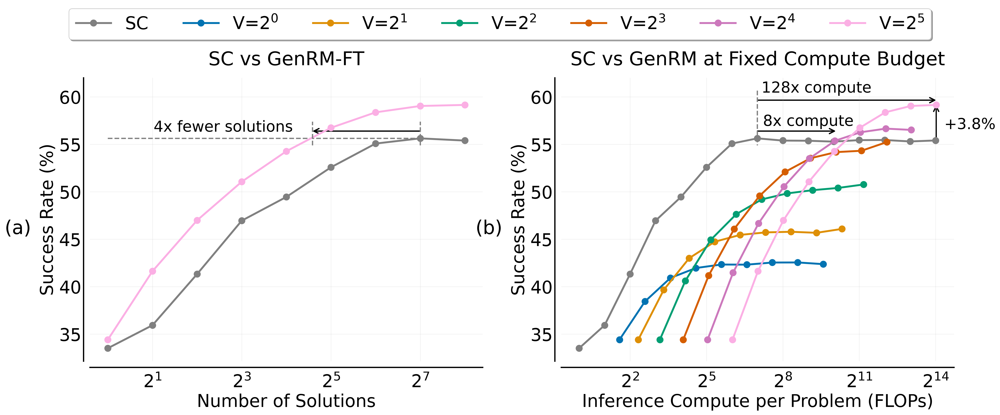

<div align="center">

<h1>[COLM 2025] When To Solve, When To Verify: Compute-Optimal Problem Solving and Generative Verification for LLM Reasoning</h1>

<p align="center">
  <a href="https://huggingface.co/sc-genrm-scaling">🤗 Huggingface</a> • <a href="https://arxiv.org/abs/2504.01005"> 📄 Paper</a>
</p>

Authors: [Nishad Singhi*](https://nishadsinghi.github.io), [Hritik Bansal*](http://sites.google.com/view/hbansal), [Arian Hosseini*](https://arianhosseini.github.io/), [Aditya Grover](https://aditya-grover.github.io/), [Kai-Wei Chang](https://web.cs.ucla.edu/~kwchang/), [Marcus Rohrbach](https://rohrbach.vision/), [Anna Rohrbach](https://anna-rohrbach.net/) \
(* Equal Contribution)

<h2 align="center">

</h2>


</div>

<!-- # When To Solve, When To Verify: Compute-Optimal Problem Solving and Generative Verification for LLM Reasoning -->

This repository contains the code needed to:
1. Generate solutions to problems from various datasets
2. Generate verifications for solutions
3. Compute Success Rates using strategies like Self-Consistency and Best-of-N

These datasets are supported:
- MATH
- AIME24
- AIME25
- GPQA-Diamond

We use [vLLM](https://docs.vllm.ai/en/latest/index.html) to do inference, so any models that they support will work with our generation scripts.

## Acknowledgements
This repository is built on the [Large Language Monkeys](https://github.com/ScalingIntelligence/large_language_monkeys/) repository.

## Installation
Create the conda environment

```bash
conda env create -f environment.yml
conda activate <environment_name>
```

## Repository Structure

The repo is organized as follows:

```
sc-genrm-scaling/
├── llmonk/
│   ├── evaluate/
│   │   ├── eval_utils.py
│   │   ├── math_datasets.py
│   │   ├── math_pass_k.py
│   │   └── plot_success_rate.py
│   ├── generate/
│   │   ├── generate_solutions.py
│   └── verify/
│   │   ├── generate_verifications.py
│   └── utils.py
├── README.md
└── environment.yml
```

- `llmonk/evaluate/`: contains the code to plot success rates
- `llmonk/generate/`: contains the code to generate samples from a model
- `llmonk/verify/`: contains code to generate verifications from a model


## Generating Solutions

### Usage 

```python
python llmonk/generate/generate_solutions.py \
model=meta-llama/Llama-3.1-8B-Instruct \
save_dir=llmonk/outputs/<output_folder_name> \
--list vllm_args --disable-log-requests list-- --list stop_strings Problem: list-- \
temperature=0.7 \
num_samples=256 \
batch_size=64 \
num_workers=32 \
zero_shot=False \
dataset=math128 \
max_tokens=1024 \
apply_chat_template=True \
save_every_n_samples=64
```

- `model`: can be any LLM supported by vLLM
- `save_dir`: path to the folder where the samples should be stored
- `temperature`: sampling temperature
- `num_samples`: the number of solutions to sample per problem
- `batch_size`: batch-size to sample from vLLM
- `num_workers`: number of workers for multiprocessing
- `zero_shot`: if this is set to `True`, a zero-shot prompt is used to prompt the LLM for sampling solutions (e.g., for QwQ-32B). If `False`, the 4-shot prompt is used.
-  `dataset`: the dataset can be one of `['math_train', 'math128', 'aime24', 'aime25', 'amc23', 'gpqa_diamond_64']`
- `max_tokens`: the maximum number of tokens that can be sampled for a solution
- `apply_chat_template`: if this is set to `True`, the chat template is applied to the prompt before passing it to the LLM. **We set this to True everywhere except where a 4-shot prompt is used**.
- `save_every_n_samples`: saves the samples in the YAML file after every `n` samples, instead of waiting for all samples to be generated before saving

You can find some more information [here](llmonk/generate/README.md).

### Output Format

The samples are saved as YAML files (one YAML file per problem). Every dataset's YAML file contains the following keys:
- `prompt`: the prompt for the problem
- `question`: the current question for the problem
- `samples`: a list of samples for each problem
- `gt_answer`: the dataset's ground truth answer for the problem


## GenRM Finetuning
First, we use a solution generator (like Llama-3.1-8B-Instruct) to generate solutions to problems in the MATH training split. Next, we use GPT-4o to generate verifications for these solutions using [this prompt](llmonk/verify/prompts/training_data_gpt4o.txt).

- GenRM fine-tuning data:
  - [Llama-3.1-8B-Instruct](https://huggingface.co/datasets/sc-genrm-scaling/genrm_gpt4o_verifs_llama_3p1_8b_solns_math_train)
  - [Qwen-2.5.-7B-Instruct](https://huggingface.co/datasets/sc-genrm-scaling/genrm_gpt4o_verifs_qwen_2p5_7b_solns_math_train)
 
Then, we use [LLaMa-Factory](https://github.com/hiyouga/LLaMA-Factory) to fine-tune LLMs to obtain GenRM-FT using LoRA with [this prompt](llmonk/verify/prompts/llama3.1_8b_instruct/finetuned.txt).

- Trained GenRM-FT verifiers:
  - [Llama-3.1-8B-Instruct](https://huggingface.co/sc-genrm-scaling/llama_3.1_8b_genrm_ft)
  - [Qwen-2.5.-7B-Instruct](https://huggingface.co/sc-genrm-scaling/qwen_2.5_7b_genrm_ft)

Our models and data, including verifications generated from various GenRMs are available [here](https://huggingface.co/sc-genrm-scaling).

A demo of verifications generated by a fine-tuned verifier is available [here](llmonk/verify/demo.ipynb).


## Generating Verifications

### Usage

```python
python3 llmonk/verify/generate_verifications.py \
model=meta-llama/Llama-3.1-8B-Instruct \
verification_template=llmonk/verify/vprompts/llama3.1_8b_instruct/genrm_base.txt \
output_dir=llmonk/outputs/verifications/<verification_folder_name> \
samples_dir=llmonk/outputs/<folder_where_solutions_are_saved> \
num_verifications=32 \
--list vllm_args --disable-log-requests list-- 
batch_size=32 \
temperature=0.7 \
logprobs=1 \
max_tokens=1024 \
num_workers=32 \
num_problems=128 \
num_solutions=256 
```

- `verification_template`: path of the template for the verification prompt
- `output_dir`: path to folder where generated verifications are stored
- `samples_dir`: path to folder where the solutions (generated in previous step) are saved (and will be loaded from)
- `num_verifications`: number of verifications per solution
- `logprobs`: how many logprobs to generate (passed to vLLM)
-  `num_problems`: number of problems to generate verifications for

You can find more information [here](llmonk/verify/README.md). A demo of verifications generated by a fine-tuned verifier is available [here](llmonk/verify/demo.ipynb).

### Output Format

The outputs are structured this way:

```
outputs/verifications
└── folder_name/
    ├── problem_0/
    │   ├── solution_0.yaml
    │   ├── solution_1.yaml
    │   ├── ...
    ├── problem_1/
    │   ├── solution_0.yaml
    │   ├── solution_1.yaml
    │   ├── ...
    ├── ...
    └── problem_127/
        ├── solution_0.yaml
        ├── solution_1.yaml
        ├── ...
```

Every problem has a separate folder, and every YAML file inside the problem contains all the verifications for one solution.

- `prompt`: the prompt to generate verifications
- `verifications`: list of all verifications. Every element in the list contains three items: 
  - `p(yes)`: probability of the token `Yes` in the sampled output
  - `p(no)`: probability of the token `No` in the sampled output
  - `verification`: the verification text


## Plot Success Rates

### Usage

```python
cd llmonk/evaluate
python plot_success_rate.py --config config/<config_name>.yaml
```

Where the config file specifies parameters for generating success rate plots. See [Config README](llmonk/evaluate/configs/README.md) for more details.


## Citation

If you use this code in your research, please cite our paper. You can use the following BibTeX entry:

```bibtex
@misc{singhi2025whentosolve,
      title={When To Solve, When To Verify: Compute-Optimal Problem Solving and Generative Verification for LLM Reasoning}, 
      author={Nishad Singhi and Hritik Bansal and Arian Hosseini and Aditya Grover and Kai-Wei Chang and Marcus Rohrbach and Anna Rohrbach},
      year={2025},
      eprint={2504.01005},
      archivePrefix={arXiv},
      primaryClass={cs.LG},
      url={https://arxiv.org/abs/2504.01005}, 
}
```
